# IoT Solutions for Smart Access Control


> "Wireless Made Easy!" - IoT Solutions for Smart Access Control

Devices: **WBZ45x SoC | PolarFire SoC FPGA | dsPIC33CK LVMC**<br>
Features: **BLE | ZIGBEE | CLOUD | VOICE ASSISTANT | AI/ML FACE RECOGNITION | MOTOR CONTROL**

<!--
**Watch the video and see how to enable ...**
<p align="center">
<a href="https://youtu.be/HWui3HDnw80" target="_blank">
</a>
</p>
-->


<p align="center">
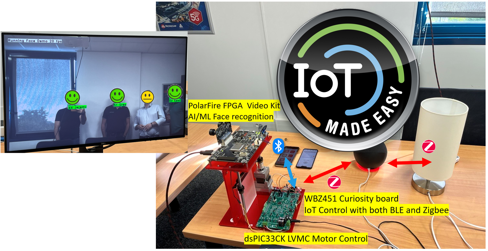
</p>


<p align="center">
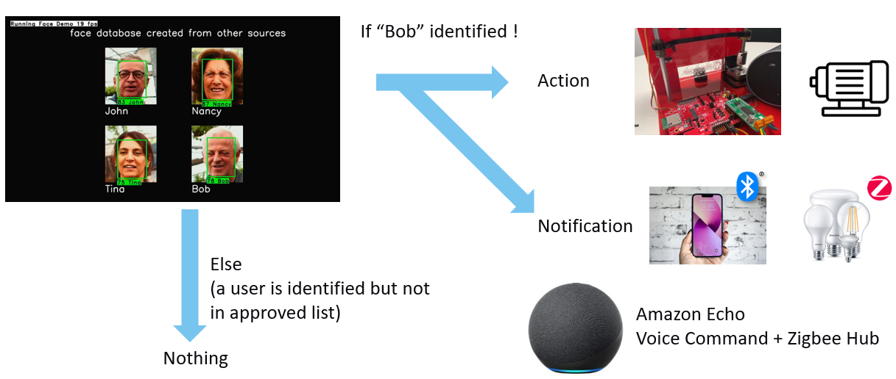
</p>


## ⚠ Disclaimer

<p><span style="color:red"><b>
THE SOFTWARE ARE PROVIDED "AS IS" AND GIVE A PATH FOR SELF-SUPPORT AND SELF-MAINTENANCE. This repository contains example code intended to help accelerate client product development. </br>

For additional Microchip repos, see: <a href="https://github.com/Microchip-MPLAB-Harmony" target="_blank">https://github.com/Microchip-MPLAB-Harmony</a>

Checkout the <a href="https://microchipsupport.force.com/s/" target="_blank">Technical support portal</a> to access our knowledge base, community forums or submit support ticket requests.
</span></p></b>

## Description

<!--Describe the purpose of the solution, the added value for our clients : The WHY

Describe how it works pratically, how it could be implemented to make easy & fast for our client while keeping System robustness : The HOW

Describe the content of this solution, taking full leverage of our products, what we sell: The WHAT
-->
...

## A la carte

1. <font size="6">[Facts and challenge of Access Control](#step1)</font>
1. <font size="6">[Our solution: "IoT Solutions for Access Control](#step2)</font>
   1. [System architecture](#step2a)
   1. [Use cases](#step2b)
      1. [Smart Home](#step2b1)
      1. [Smart Building](#step2b2)
      1. [Industry 4.0](#step2b3)
   1. [Technology Bricks](#step2c)
      1. [AI/ML Face Recognition](#step2c1)
      1. [BLDC Motor Control](#step2c2)
      1. [Voice and remote Control](#step2c3)
1. <font size="6">[Do It Yourself](#step3)</font>
   1. [Bill of materials](#step3a)
   1. [Mechanical Setup](#step3b)
   1. [Motor Setup](#step3c)
   1. [Hardware Setup](#step3d)
   1. [Software Setup for the WBZ45x](#step3e)
   1. [Software Setup for the dsPIC33CK](#step3f)
   1. [Software Setup for the PolarFire FPGA](#step3g)
1. <font size="6">[Run the demo](#step4)</font>
1. <font size="6">[FAQ](#step5)</font>


## Facts and challenges of Access Control <a name="step1"></a>

...

<a href="#top">Back to top</a>

## Our solution: "IoT Solutions for Access Control" <a name="step2"></a>

...

### System architecture <a name="step2a"></a>

<p align="center">
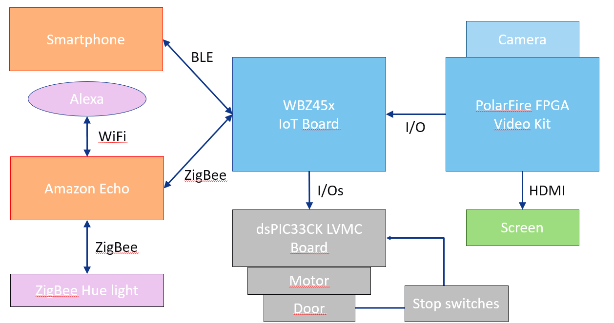
</p>


### Use cases <a name="step2b"></a>

<p align="center">

</p>

#### Smart Home <a name="step2b1"></a>

...


#### Smart Building <a name="step2b2"></a>

...

#### Industry 4.0 <a name="step2b3"></a>

...

### Technology Bricks <a name="step2c"></a>

<p align="center">
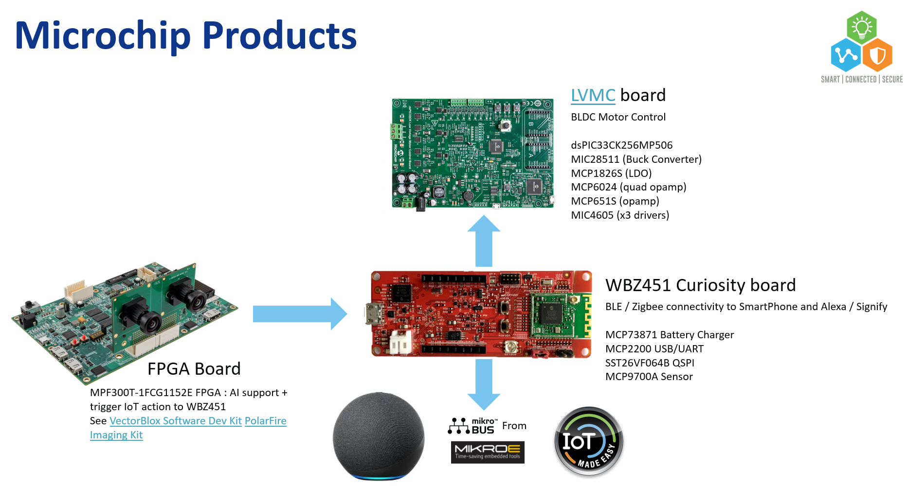
</p>

#### AI/ML Face Recognition <a name="step2c1"></a>

This Smart Access Control demonstrates the usage of VectorBlox software development kits and PolarFire FPGAs for artificial intelligence (AI) and machine learning (ML) in real world scenario.

The steps required to quickly get started with evaluating AI and ML algorithms using Microchip Technology's PolarFire Video Kit are detailled in the following links.

This kit includes the VectorBlox Accelerator SDK, designed to enable developers to code in C/C++ and program power-efficient neural networks without prior FPGA design experience. This highly flexible SDK can execute models in TensorFlow and the open neural network exchange (ONNX) format, which offers the widest framework interoperability.

The VectorBlox Accelerator SDK is supported on Linux and Windows and also includes a bit-accurate simulator which provides the opportunity to validate the accuracy of the hardware while in the software environment. The neural network IP also included with the PolarFire Video Kit also supports the ability to load different network models at runtime.

* <a href="https://www.microchip.com/en-us/development-tool/MPF300-VIDEO-KIT-NS" target="_blank">PolarFire FPGA Video Kit landing page</a>
* <a href="https://www.microchip.com/en-us/products/fpgas-and-plds/fpga-and-soc-design-tools/vectorblox" target="_blank">VectorBlox Getting Started</a>
* <a href="https://github.com/Microchip-Vectorblox/VectorBlox-SDK" target="_blank">VectorBlox SDK</a>
* <a href="https://youtu.be/a4-YiZ05QGU" target="_blank">Introducing Microchip's VectorBlox™ Accelerator Software Development Kit & Neural Network IP (VIDEO)

#### BLDC Motor Control <a name="step2c2"></a>

The dsPIC33CK Low Voltage Motor Control (LVMC) Development Board is a cost-effective rapid development platform for Brushless DC (BLDC), Permanent Magnet Synchronous Motor (PMSM) and Internal Permanent Magnet (IPM) motor control applications. The LVMC board features the high performance, single core [dsPIC33CK256MP507](https://www.microchip.com/en-us/product/dsPIC33CK256MP506) Digital Signal Controller (DSC).

* <a href="https://www.microchip.com/en-us/development-tool/DM330031" target="_blank">dsPIC33CK LVMC landing page</a>
* <a href="https://ww1.microchip.com/downloads/aemDocuments/documents/OTH/ApplicationNotes/ApplicationNotes/BLDCMC00957a.pdf" target="_blank">AN957 - Sensored BLDC Motor Control Using dsPIC Digital Signal Controllers (DSCs)</a>
* <a href="https://ww1.microchip.com/downloads/en/Appnotes/AN957_dsPIC33CK256MP508_EXT_OPAMP_MCLV2_MCHV2_MCHV3_R1_RC2.zip" target="_blank">AN957 - Source Code for dsPIC33CK256MP508 BDLC Motor Control</a>
* <a href="https://ww1.microchip.com/downloads/aemDocuments/documents/OTH/ApplicationNotes/ApplicationNotes/01017A.pdf" target="_blank">AN1017 - Application note for the motor control algorithm</a>


#### IoT Control with both BLE and Zigbee <a name="step2c3"></a>

The PIC32CXBZ2 SoC and WBZ45x Module enable IoT (Internet of Things) wireless connectivity by providing low power devices with certified radio technologies such as BLE 5.2 along with IEEE 802.15.4 radio in a single chip solution. The WBZ45x module enables users to interact with Bluetooth and/or IEEE 802.15.4 networks.

* <a href="https://www.microchip.com/en-us/development-tool/EA71C53A" target="_blank">WBZ45x landing page</a>
* <a href="https://github.com/MicrochipTech/EA71C53A" target="_blank">WBZ45x SDK</a>

<a href="#top">Back to top</a>

## Do It Yourself <a name="step3"></a>

### Bill of materials <a name="step3a"></a>

#### Microchip Development Board

Purchase the following development boards:

- [dsPIC33CK LVMC Board](https://www.microchipdirect.com/dev-tools/DM330031)
- [WBZ45x IoT Board](https://www.microchipdirect.com/dev-tools/EA71C53A)
- [PolarFire FPGA Video Kit](https://www.microchipdirect.com/dev-tools/MPF300-VIDEO-KIT-NS)

#### Mechanical pieces

- [3-Phase Brushless DC Motor](https://www.microchip.com/en-us/development-tool/AC300020)
- [Coupling beam](https://www.amazon.fr/sourcing-map-Aluminium-Couplage-Connecteur/dp/B092D8WGNZ)
- [Threaded rod](https://fr.farnell.com/duratool/d00808/gougon-acier-inoxydable-m8/dp/2444322)
- [Smooth rod](https://fr.rs-online.com/web/p/tubes-et-profiles-de-structures/7866006)
- [2x limit switches](https://fr.farnell.com/omron-electronic-components/ss-5gl13/commutateur-encliquetable-spdt/dp/1608303)
- [Ball bearing](https://fr.rs-online.com/web/p/roulements-a-billes/6190036)
- [flange bearing](https://euro-makers.com/fr/roulements-a-billes/2592-httpeuro-makerscomroulements-a-billes2592-rou-plapkfl08html-3701172915174.html)

#### Structure

- [Plexiglass (PMMA)](https://www.leroymerlin.fr/produits/menuiserie/panneau-bois-tablette-etagere-tasseau-moulure-et-plinthe/verre-verre-synthetique-et-accessoires/verre-et-plaque-polystyrene/plaque-pmma-5-mm-rouge-mat-l-100-x-50-cm-80120003.html)

#### Connectors and power supply

- HDMI cable
- Wires (20 should be enough)
- 9V power supply for dsPIC33CK LVMC Board
- 12V power supply for PolarFire FPGA Video Kit
- 18V power supply for the Amazon Echo

#### Others

- [Amazon Echo](https://www.amazon.fr/nouvel-echo-4e-generation-avec-son-premium-hub-connecte-et-alexa-anthracite/dp/B085FXHR38)
- [Philips Hue bulb](https://www.amazon.fr/Philips-connect%C3%A9e-Equivalent-Compatible-Bluetooth/dp/B099P3CP1K)
- A power strip with 4/5 plugs


### Mechanical Setup <a name="step3b"></a>

#### Door structure

The structure of the door is composed of four plexiglass pieces. Brackets, screws and nuts are also required.

- The bottom piece

<p align="center">
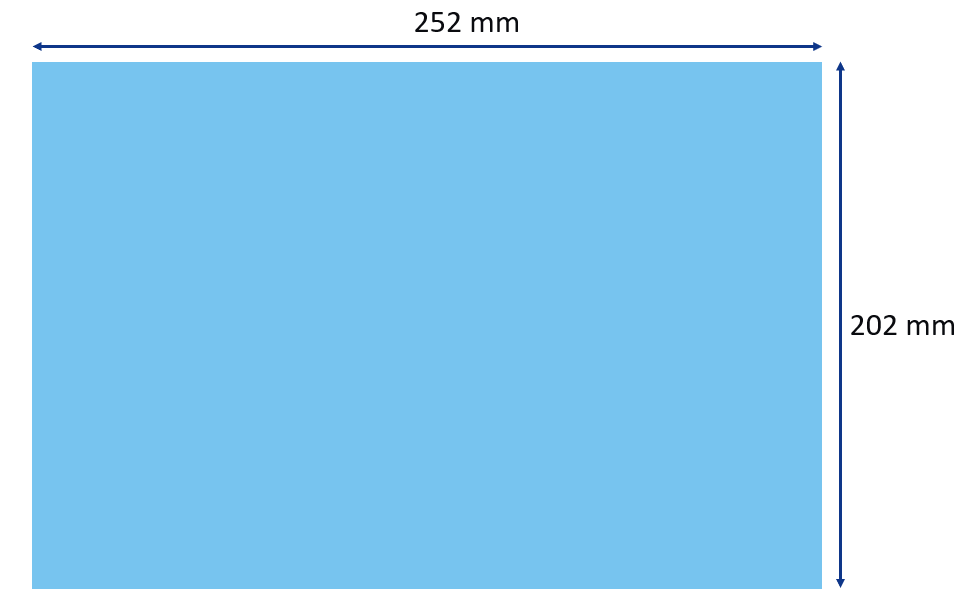
</p>

- The vertical piece

<p align="center">
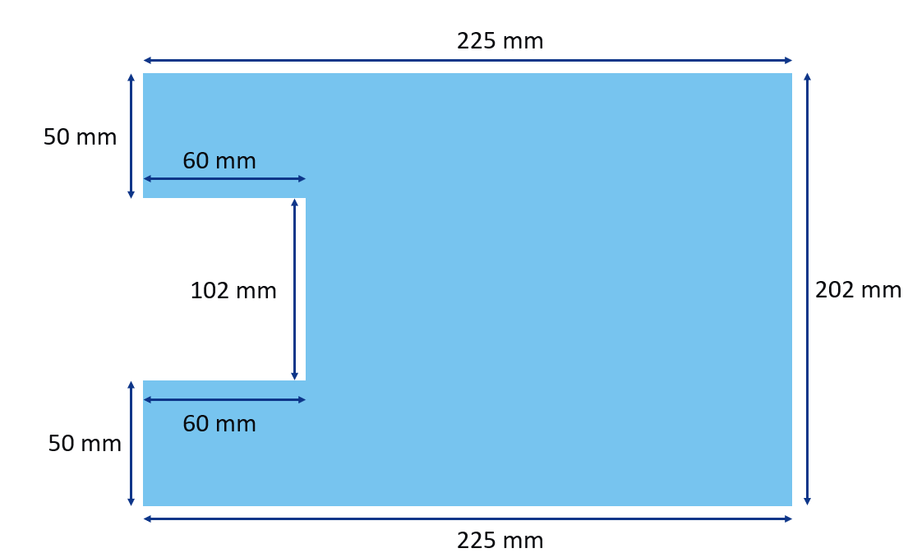
</p>

- The top piece

<p align="center">
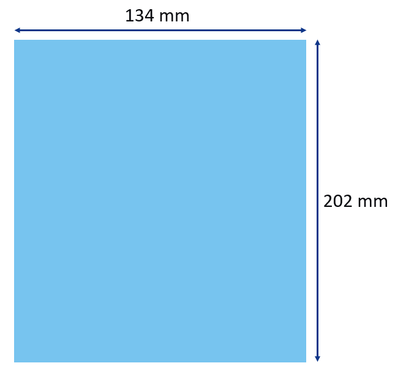
</p>

- The door itself

<p align="center">
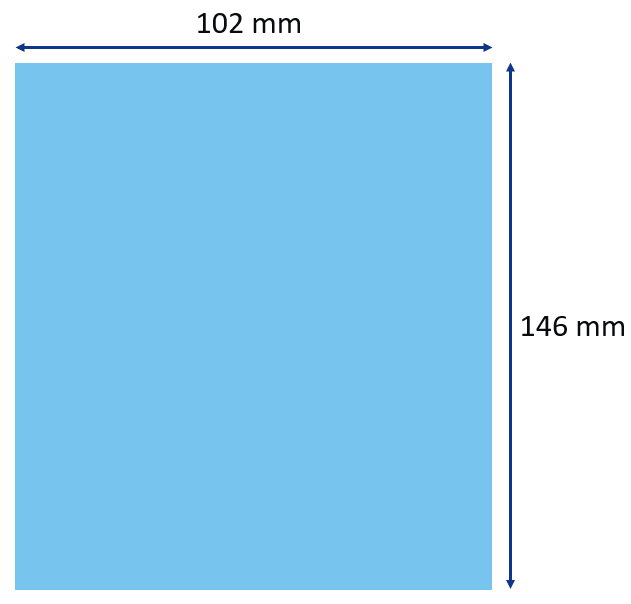
</p>

### Motor Setup <a name="step3c"></a>

Plug the coupling beam, the threaded rod then the black piece and the "stop à bille". 

On the other side of the door plug the ball bearing into the black piece, then the smooth rod into the ball bearing and finaly into the "stop à bille".

### Hardware Setup <a name="step3d"></a>

<p align="center">
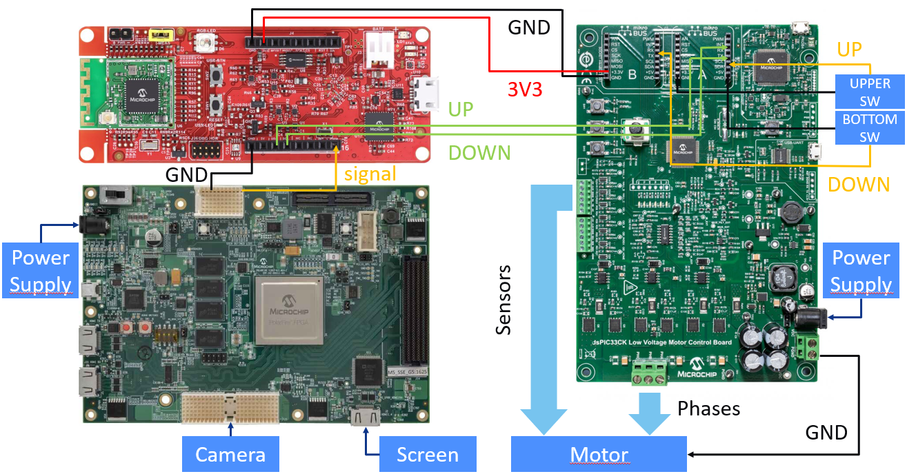
</p>


<p align="center">
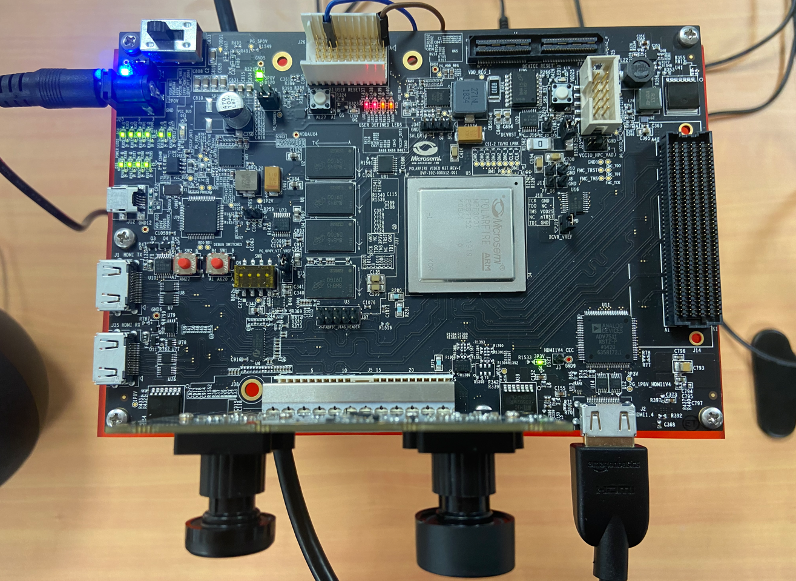
</p>

<p align="center">
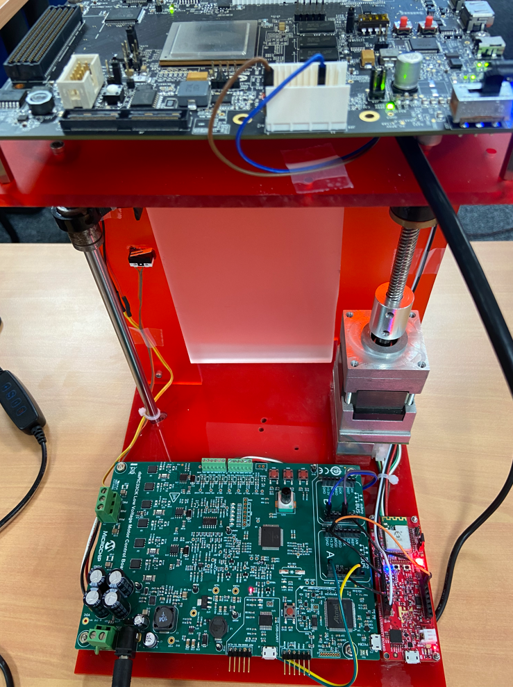
</p>

<p align="center">
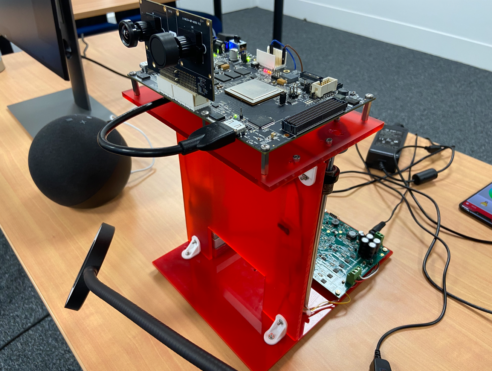
</p>


### Software Setup for the WBZ45x <a name="step3e"></a>

#### Software Content

Extract the file: *firmware/WBZ45x_project/WBZ45x_project.zip* to a hard drive root folder (i.e. *C:\ac_demo\firmware*).

#### Programming the precompiled hex file using MPLABX IPE

Plug the WBZ45x Curiosity board to your computer through a micro-USB cable.

Using MPLAB® IPE v6.0 :
- Select WBZ451 as Device to flash and hit the 'Apply' button
- Select the tool: Curiosity/Starter Kits (PKOB4)
- Browse the following .hex file: *firmware/WBZ45x_project/ble_zigbee_light_prov/precompiled_hex/ble_zigbee_light_prov.X.production.hex*
- Hit the 'Program' button

<p align="center">
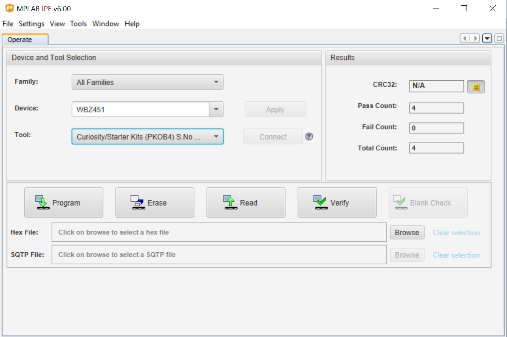
</p>

#### Starting from the Out of the box example

Here the code running on the WBZ45x Curiosity board, is based on the Out of the Box demo (OoB) example code named *ble_zigbee_light_prov* that you can find in:
- [WBZ45x Early adopter package](https://github.com/MicrochipTech/EA71C53A/tree/master/H3/wireless_apps_pic32cxbz2_wbz45/apps/multiprotocol/ble_zigbee_light_prov)
- [Harmony GitHub](https://github.com/Microchip-MPLAB-Harmony/wireless_apps_pic32cxbz2_wbz45/apps/multiprotocol/ble_zigbee_light_prov)

##### Required software components

Please follow the [SDK setup](https://github.com/MicrochipTech/EA71C53A/blob/master/Documentation/PIC32CX-BZWBZ45x%20SDK%20Setup.pdf) to get a workspace well configured and ready to modify the MCC Harmony project and the code, build and flash the WBZ451 target.

##### MCC Harmony Configuration

Open *ble_zigbee_light_prov/firmware/ble_zigbee_light_prov.X* from Harmony apps and start MCC Harmony. 

The main MCC Harmony scheme will not be modified, we will just add 3 I/Os to manage communication between the WBZ45x board and the two daughter boards: FPGA and motor control boards:

- Pin RA2 configured as EXTINT3 with a pullup: to interface with the FPGA board
- Pin RA13 and RA14 configured as GPIO out: to interface with the motor control board

<p align="center">
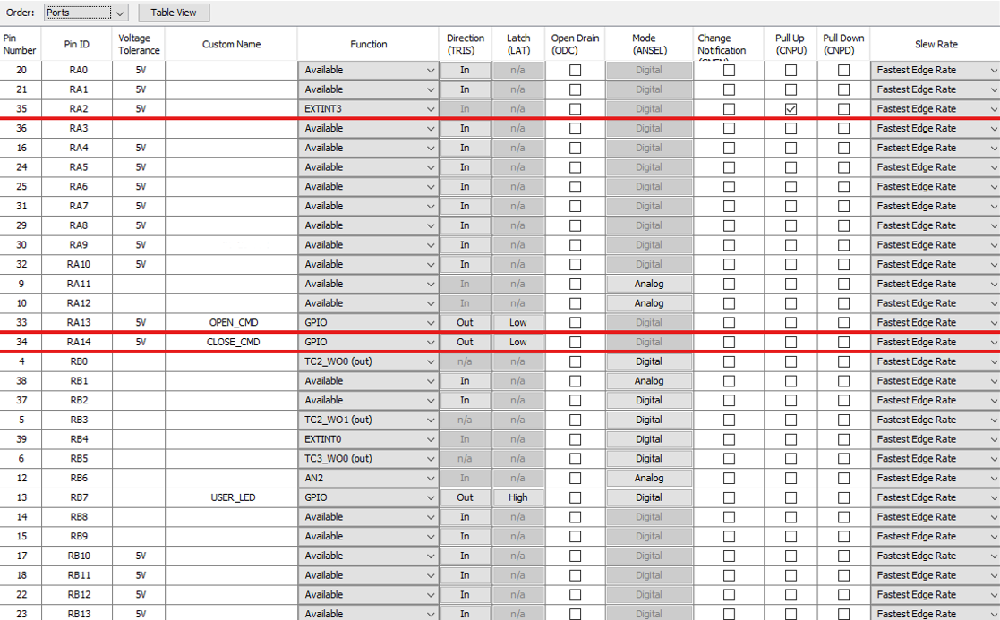
</p>

In project graph, click on EIC component and configure channel 3 as following:

<p align="center">
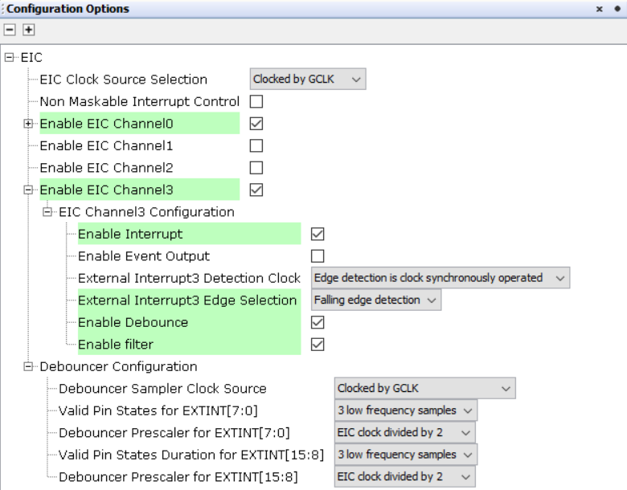
</p>

Then generate the code and close MCC.

##### Code modification

**For this section, you will find all code to copy paste in the following folder: *firmware/WBZ45x_project/additional_sources***

- In *app.c* around line 250, add the code from *app.txt*.</br>
  Do not forget to add the prototype in *app.h*.
- In *app_button_handler.c* around line 92, replace **APP_Button_Handler** with the given function in *app_button_handler.txt*, and add function **APP_FPGA_Callback** and **APP_FPGA_Handler**. This code correspond to the trigger of the door and the wireless communications via the button and the face recognition. 
- In *app_ble_sensor.c* around line 115, replace **APP_TRPS_Sensor_LED_Ctrl** function with the given function in *app_ble_sensor.txt*. This code correspond to the trigger of the motor with BLE connectivity.</br>
Do not forget to add the prototype in *app_button_handler.h*
- In *app_zigbee_handler.c* line 560, replace switch case **CMD_ZCL_ON** and **CMD_ZCL_OFF** with those in *app_zigbee_handler.txt*. This snippet of code correspond to the trigger of the motor with ZigBee connectivity.

### Software Setup for the dsPIC33CK <a name="step3f"></a>

#### State machine

<p align="center">
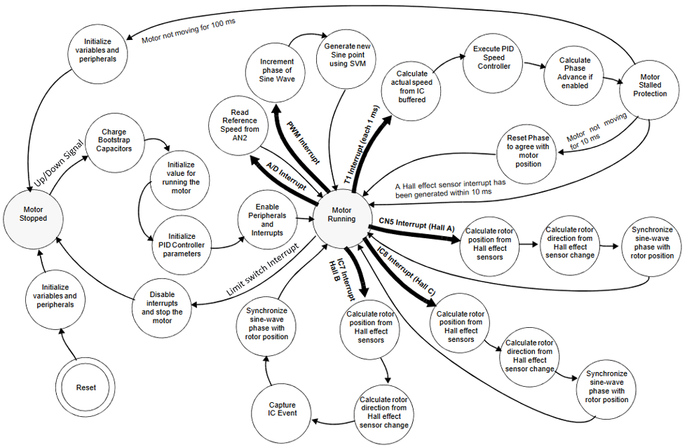
</p>

#### Software Content

Extract the file: *firmware/dsPIC33CK_project/dsPIC33CK_project.zip* to a hard drive root folder (i.e. *C:\ac_demo\firmware*).

#### Programming the precompiled hex file using MPLABX IPE

Plug your PICkit3 or PICkit4 to your computer through a micro-USB cable and to the dsPIC33CK LVMC board through the 6-pins connector on the right side of the board.

Using MPLAB® IPE v6.0 :
- Select dsPIC33CK256MP506 as Device to flash and hit 'Apply'
- Select the Tool: PICkit3 or PICkit4
- Browse the following .hex file: *firmware/dsPIC33CK_project/precompiled_hex/bldc.X.production.hex*
- Hit 'Program' button

<p align="center">

</p>

#### Start from AN957 Application note

##### Required software components

- [MPLAB® X v6.0](https://www.microchip.com/en-us/tools-resources/develop/mplab-x-ide)
- [Microchip Code Configurator (MCC) v5.1.17](https://www.microchip.com/en-us/tools-resources/configure/mplab-code-configurator)

##### MCC Configuration

Open *dsPIC33CK_project/bldc.X* and start MCC. We will just add 4 I/Os to manage the limit switchs interrupts and the communication between the WBZ45x curiosity and motor control board:

- RA5 - interrupt INPUT pin comming from the bottom switch
- RA6 - command OUTPUT pin to open the door
- RA7 - command OUTPUT pin to close the door
- RA15 - interrupt INPUT pin comming from the upper switch

First, open the grid view and activate the 4 pins:

<p align="center">
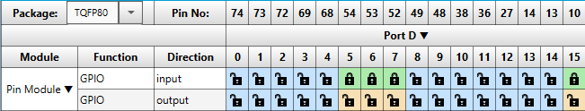
</p>

Then configure the pins as following:

<p align="center">
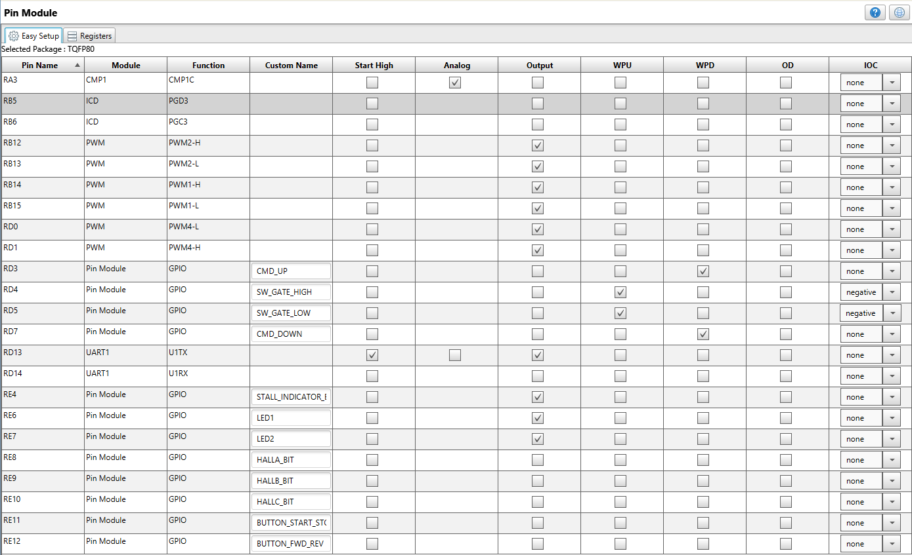
</p>

Generate the code and close MCC.

##### Code modification

Open *firmware/dsPIC33CK_project/additional_sources/main.txt* and copy paste the code into the *main.c* file of your project.

This code correspond to :

- The main state machine of the application.
- The motor control state machine.
- The handler for the switch interrupts.
- Some other functions used in the motor control state machine.


### Software Setup for the PolarFire FPGA <a name="step3g"></a>

#### Software content

The GitHub repo does not contain the FPGA project but it contains all the steps to customize the original VectorBlox and face recognition demo.

To match with the Access Control demo, it is required to:

* Get started with the default package by installing the required tools
* Customize the default demo package
* Set the image database for Face recognition
* Flash the board with updated content

#### Getting started with the default package

To getting started with default package VectorBlox and face recognition, make sure to check the following items:

- Download the VectorBlox SDK from [GitHub](https://github.com/Microchip-Vectorblox/VectorBlox-SDK.git) and use the Programmers Guide to install
- Purchase the [PolarFire FPGA Video and Imaging Kit](http://www.microsemi.com/existing-parts/parts/150804)
- Download and install [Libero® SoC Design Suite 2021.3](https://www.microchip.com/en-us/products/fpgas-and-plds/fpga-and-soc-design-tools/fpga/libero-software-later-versions)
- Get a free [Libero SoC Silver License](https://www.microchipdirect.com/fpga-software-products)
- Get a free [Libero SoC VectorBlox License](https://www.microchipdirect.com/fpga-software-products) (required in addition to the above license)
- **[Reference Design](https://vector-blox-model-zoo.s3.us-west-2.amazonaws.com/Releases/VideoKit/vectorblox_videokit_v1.3.1.zip) for the PolarFire FPGA Video and Imaging Kit** (need to be updated with the new project to match this demo)

#### Demo customization

1. Download the [Libero® SoC 2021.3 Smart Camera Reference Design](https://vector-blox-model-zoo.s3.us-west-2.amazonaws.com/Releases/VideoKit/vectorblox_videokit_v1.3.1.zip) for the PolarFire FPGA Video and Imaging Kit

2. We will have to set an open drain output that we will connect to the WBZ45x Curiosity board. If the PolarFire recognize a person, the WBZ45x device will ask the motor control board to open the garage door. The state of the I/O will change and go from 0 to 1 while there is a person recognized by the system.

   a. Unzip and open the vectorblox_videokit_v1.3.1 project from the original [Reference Design](https://vector-blox-model-zoo.s3.us-west-2.amazonaws.com/Releases/VideoKit/vectorblox_videokit_v1.3.1.zip)

   b. Open the project using [Libero® SoC Design Suite 2021.3](https://www.microchip.com/en-us/products/fpgas-and-plds/fpga-and-soc-design-tools/fpga/libero-software-later-versions)

   c. Modify CoreGPIO_OUT in PROC_SUBSYSTEM

   * Add 2 OUTPUT - in our case GPIO_OUT[6:5] and leave the settings by default</br></br>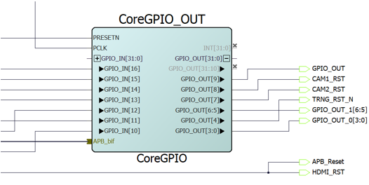

   * Update PROC_SUBSYSTEM_0 and promote the new GPIO_OUTPUT to Top Level
   * As we want to have open drain outputs, please refer to cahpter 7.1.13 of the ["PolarFire FPGA and PolarFire SoC FPGA User I/O User Guide"](https://ww1.microchip.com/downloads/aemDocuments/documents/FPGA/ProductDocuments/UserGuides/Microchip_PolarFire_FPGA_and_PolarFire_SoC_FPGA_User_IO_User_Guide_VC.pdf)
   </br></br>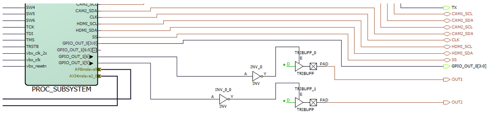

   * You will then have to update the I/O Attributes. On the PolarFire Video Kit, we will use pins from the Display Connector J26. </br>
   So, we will connect our outputs as below:</br>
     - Connect OUT 1 to pin A2 of the PolarFire FPGA (Pin B1 of the Video Kit Display Port)
     - Connect OUT 2 to pin B4 of the PolarFire FPGA (Pin A1 of the Video Kit Display Port)
     - I/O Configuration:
        - Clamp = OFF
        - RES_PULL = NONE
        - Bank VDDI = 2.5V
        
   </br></br>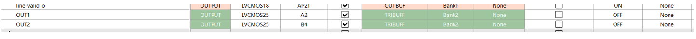

   Your project is now ready, you should be able to RUN the project.

3. We will now modify the Software in SoftConsole

   a. In *main.c*, you will need to define OUT1 & OUT2

   ```
   #define OUT1 GPIO_5
   #define OUT2 GPIO_6
   ```

   b. Then, setup the GPIOs as output

   ```
   GPIO_set_output(&g_gpio_out, OUT1, 1) ;
   GPIO_set_output(&g_gpio_out, OUT2, 1) ;
   ```

   c. In the file *faceDetectDemo.c*, set the custom GPIOs to 0 if there is a similarity and face recognized
   </br></br>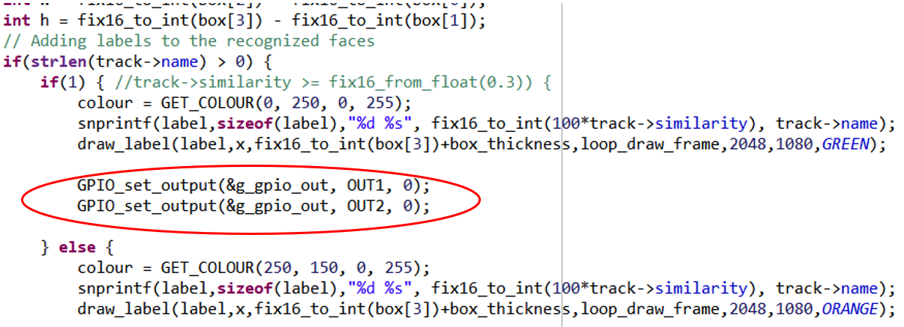

   d. Then, in the file *faceDetectDemo.c*, set the output back to 1 when the program is starting to scale a new frame
   </br></br>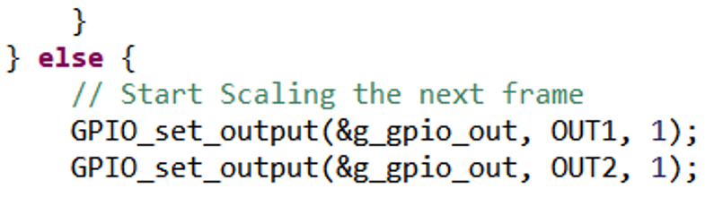

   Your software is now modified.


#### Setting-up the image database for Face Recognition

1. The project is already running the face recognition Demo using the existing Image Database as created by the VectorBlox-SDK at the following Link. </br> [https://github.com/Microchip-Vectorblox/VectorBlox-SDK/tree/master/example/python/faceDemo/dbImages](https://github.com/Microchip-Vectorblox/VectorBlox-SDK/tree/master/example/python/faceDemo/dbImages)

2. To detect known faces in the surroundings through Videokit, the Image Database in the project must be updated with the new Images. To update the Image Database, one need to be able to execute examples and tutorials for VectorBlox-SDK Release 1.3. </br> To setup the VectorBlox-SDK following steps must be followed.</br>  [https://github.com/Microchip-Vectorblox/VectorBlox-SDK](https://github.com/Microchip-Vectorblox/VectorBlox-SDK)

3. Download the [VectorBlox-SDK release 1.3.0](https://github.com/Microchip-Vectorblox/VectorBlox-SDK/releases/tag/release-v1.3.0)

4. Change the permissions of the copied folder using:</br> 
```sudo chmod -R 777 VectorBlox-SDK-release-v1.3.0/```

5. Follow the below steps</br>
```
cd VectorBlox-SDK-release-v1.3.0/
sudo bash
```
(Note: remember executing the scripts in the SDK requires switching to bash)
```
bash install_dependencies.sh
source setup_vars.sh
```

6. Before updating the database, follow the below steps</br>
[https://github.com/Microchip-Vectorblox/VectorBlox-SDK/blob/master/app_notes/updating_face_recognition_database.md#preparing-models](https://github.com/Microchip-Vectorblox/VectorBlox-SDK/blob/master/app_notes/updating_face_recognition_database.md#preparing-models)
```
cd $VBX_SDK/tutorials/mxnet/mobilefacenet-arcface
bash mobilefacenet-arcface.sh
```
(Before creating the Database step, the known Images should be copied to the following folder of WSL ubuntu)

*C:\Users\MXXXXX\AppData\Local\Packages\CanonicalGroupLimited.Ubuntu20.04LTS_79rhkp1fndgsc\LocalState\rootfs\home\username\VectorBlox-SDK-release-v1.3.0\example\python\faceDemo\dbImages*

(Note: only images in .png and .jpg format are accepted)


7. Issue the following commands to update the Database</br>
[https://github.com/Microchip-Vectorblox/VectorBlox-SDK/blob/master/app_notes/updating_face_recognition_database.md](https://github.com/Microchip-Vectorblox/VectorBlox-SDK/blob/master/app_notes/updating_face_recognition_database.md)

```
cd example/python/faceDemo/
python createdDb.py
python exportDb.py
```

(Note: python processImage.py command throws errors, but it is not required as it is only a sanity check on the added Images which is not working in this release. In addition, the steps to update the Database are described on the following link as well.)


8. Copy the code generated in *C:\Users\MXXXXX\AppData\Local\Packages\CanonicalGroupLimited.Ubuntu20.04LTS_79rhkp1fndgsc\LocalState\rootfs\home\username\VectorBlox-SDK-release-v1.3.0\example\python\faceDemo\faceDb.c* to the following .c file of the SoftConsole Project: *C:\Users\ MXXXXX\Downloads\vectorblox_videokit_v1.3\softconsole\Videokit\faceDetection\faceDetectDemo.c*. </br>
Copy the entire code from the generated file *faceDb.c* and replace the corresponding code in *faceDetectDemo.c* from the SoftConsole Project starting at the line number 79</br>
```
#define DB_LENGTH 79
#define EMBEDDING_LENGTH 128
```

9. Build the SoftConsole Project and one should be able to run the Demo with updated Database through FlashPro Interface. The Project can be built in Release Mode. Debug Mode build shows error which must be fixed. Release Mode is good enough to run the Demo

10. To run the Demo without Debug Interface, updated SoftConsole Project hex file should replace the existing FabricRAM hex file in the Libero SoC Project. For further details about how to program the FPGA and SPI Flash with the updated files, refer to the Section 5.2.2 in the below document.</br>
[https://vector-blox-model-zoo.s3.us-west-2.amazonaws.com/Releases/VideoKit/vectorblox_videokit_v1.3.pdf](https://vector-blox-model-zoo.s3.us-west-2.amazonaws.com/Releases/VideoKit/vectorblox_videokit_v1.3.pdf)


#### Flash the board

Follow the documentation below to flash the board with the new images:

- Read the [Programmers Guide](https://github.com/Microchip-Vectorblox/VectorBlox-SDK/blob/master/docs/VectorBloxPG.pdf) and the [Demo Guide](https://vector-blox-model-zoo.s3.us-west-2.amazonaws.com/Releases/VideoKit/vectorblox_videokit_v1.3.pdf) to install the reference design


<a href="#top">Back to top</a>

## Run the demo <a name="step4"></a>


<a href="#top">Back to top</a>

## FAQ <a name="step5"></a>


<a href="#top">Back to top</a>
