# IoT Solutions for Smart Access Control


> "Wireless Made Easy!" - IoT Solutions for Smart Access Control

Devices: **WBZ45x SoC | PolarFire SoC FPGA | dsPIC33CK LVMC**<br>
Features: **BLE | ZIGBEE | CLOUD | VOICE ASSISTANT | AI/ML FACE RECOGNITION | MOTOR CONTROL**

<!--
**Watch the video and see how to enable ...**
<p align="center">
<a href="https://youtu.be/HWui3HDnw80" target="_blank">
</a>
</p>
-->

<p align="center">

</p>

<p align="center">

</p>


## ⚠ Disclaimer

<p><span style="color:red"><b>
THE SOFTWARE ARE PROVIDED "AS IS" AND GIVE A PATH FOR SELF-SUPPORT AND SELF-MAINTENANCE. This repository contains example code intended to help accelerate client product development. </br>

For additional Microchip repos, see: <a href="https://github.com/Microchip-MPLAB-Harmony" target="_blank">https://github.com/Microchip-MPLAB-Harmony</a>

Checkout the <a href="https://microchipsupport.force.com/s/" target="_blank">Technical support portal</a> to access our knowledge base, community forums or submit support ticket requests.
</span></p></b>

## A la carte

1. <font size="6">[Facts and challenge of Access Control](#step1)</font>
1. <font size="6">[Our solution: "IoT Solutions for Access Control](#step2)</font>
   1. [System architecture](#step2a)
   1. [Use cases](#step2b)
      1. [Smart Home](#step2b1)
      1. [Smart Building](#step2b2)
      1. [Industry 4.0](#step2b3)
   1. [Technology Bricks](#step2c)
      1. [AI/ML Face Recognition](#step2c1)
      1. [BLDC Motor Control](#step2c2)
      1. [Voice and remote Control](#step2c3)
1. <font size="6">[Assemble the existing demo](#step3)</font>
1. <font size="6">[Do It Yourself](#step4)</font>
   1. [Bill of materials](#step4a)
   1. [Mechanical Setup](#step4b)
   1. [Motor Setup](#step4c)
   1. [Hardware Setup](#step4d)
   1. [Software Setup for the WBZ45x](#step4e)
   1. [Software Setup for the dsPIC33CK](#step4f)
   1. [Software Setup for the PolarFire FPGA](#step4g)
   1. [Cloud Setup](#step4h)
1. <font size="6">[Run the demo](#step5)</font>
1. <font size="6">[FAQ](#step6)</font>


## Facts and challenges of Access Control <a name="step1"></a>

In the market, security and safety must be warranty with no compromise. Checking who is present in a particular location, at what time, are the childs are at home and back from school ? In the industrial area, protect people from critical devices is key. So to ensure security and safety, it is needed to perform sensing and report the information.

Sensing can be done through object detection or person detection with a powerful device and Microchip offers several solutions in that way. 
- Solutions with microprocessor such as [SAMA5D2](https://www.microchip.com/en-us/products/microcontrollers-and-microprocessors/32-bit-mpus/sama5/sama5d2-series) or [SAMA7G54](https://www.microchip.com/en-us/product/sama7g54)
- Solutions with FPGA such as [PolarFire](https://www.microchip.com/en-us/products/fpgas-and-plds/fpgas/polarfire-fpgas)

For this demo, we have selected the [PolarFire FPGA](https://www.microchip.com/en-us/products/fpgas-and-plds/fpgas/polarfire-fpgas) for sensing the persons and took benefit from the [PolarFire FPGA Video and Imaging Kit with MPF300T Device](https://www.microchip.com/en-us/development-tool/MPF300-VIDEO-KIT-NS) with AI and ML capabilities.

Reporting the information can be done through different ways. And here we have selected to use wireless technology and the WBZ451 module for the capability to support Bluetooth Low Energy and Zigbee connectivity simultaneously.


<a href="#top">Back to top</a>


## Our solution: "IoT Solutions for Access Control" <a name="step2"></a>

### System architecture <a name="step2a"></a>

<p align="center">

</p>


### Use cases <a name="step2b"></a>

<p align="center">
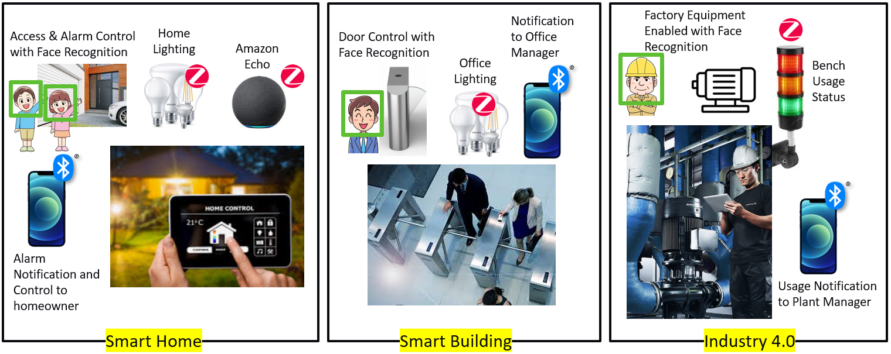
</p>

#### Smart Home <a name="step2b1"></a>

Typical use case for Smart Home is illustrated by this demo: face recognition is required to open the garage door, disarm the home alarm and turn ON the lights.

#### Smart Building <a name="step2b2"></a>

For Smart Building, access control with a granted access could be required to enter into a building.

That enable another use case: the energy management with a smart lighting system turning ON the lights if a person is authorized to enter into the building.

#### Industry 4.0 <a name="step2b3"></a>

For Industrial plant, access control with recognition could be necessary to check if a person is authorized and if he has the requested equipment to operate on a machine. For example, the user must wear the helmet.

### Technology Bricks <a name="step2c"></a>

<p align="center">

</p>

#### AI/ML Face Recognition <a name="step2c1"></a>

This Smart Access Control demonstrates the usage of VectorBlox software development kits and PolarFire FPGAs for artificial intelligence (AI) and machine learning (ML) in real world scenario.

The steps required to quickly get started with evaluating AI and ML algorithms using Microchip Technology's PolarFire Video Kit are detailled in the following links.

This kit includes the VectorBlox Accelerator SDK, designed to enable developers to code in C/C++ and program power-efficient neural networks without prior FPGA design experience. This highly flexible SDK can execute models in TensorFlow and the open neural network exchange (ONNX) format, which offers the widest framework interoperability.

The VectorBlox Accelerator SDK is supported on Linux and Windows and also includes a bit-accurate simulator which provides the opportunity to validate the accuracy of the hardware while in the software environment. The neural network IP also included with the PolarFire Video Kit also supports the ability to load different network models at runtime.

* <a href="https://www.microchip.com/en-us/development-tool/MPF300-VIDEO-KIT-NS" target="_blank">PolarFire FPGA Video Kit landing page</a>
* <a href="https://www.microchip.com/en-us/products/fpgas-and-plds/fpga-and-soc-design-tools/vectorblox" target="_blank">VectorBlox Getting Started</a>
* <a href="https://github.com/Microchip-Vectorblox/VectorBlox-SDK" target="_blank">VectorBlox SDK</a>
* <a href="https://youtu.be/a4-YiZ05QGU" target="_blank">Introducing Microchip's VectorBlox™ Accelerator Software Development Kit & Neural Network IP (VIDEO)

#### BLDC Motor Control <a name="step2c2"></a>

The dsPIC33CK Low Voltage Motor Control (LVMC) Development Board is a cost-effective rapid development platform for Brushless DC (BLDC), Permanent Magnet Synchronous Motor (PMSM) and Internal Permanent Magnet (IPM) motor control applications. The LVMC board features the high performance, single core [dsPIC33CK256MP507](https://www.microchip.com/en-us/product/dsPIC33CK256MP506) Digital Signal Controller (DSC).

* <a href="https://www.microchip.com/en-us/development-tool/DM330031" target="_blank">dsPIC33CK LVMC landing page</a>
* <a href="https://ww1.microchip.com/downloads/aemDocuments/documents/OTH/ApplicationNotes/ApplicationNotes/BLDCMC00957a.pdf" target="_blank">AN957 - Sensored BLDC Motor Control Using dsPIC Digital Signal Controllers (DSCs)</a>
* <a href="https://ww1.microchip.com/downloads/en/Appnotes/AN957_dsPIC33CK256MP508_EXT_OPAMP_MCLV2_MCHV2_MCHV3_R1_RC2.zip" target="_blank">AN957 - Source Code for dsPIC33CK256MP508 BDLC Motor Control</a>
* <a href="https://ww1.microchip.com/downloads/aemDocuments/documents/OTH/ApplicationNotes/ApplicationNotes/01017A.pdf" target="_blank">AN1017 - Application note for the motor control algorithm</a>


#### IoT Control with both BLE and Zigbee <a name="step2c3"></a>

The PIC32CXBZ2 SoC and WBZ45x Module enable IoT (Internet of Things) wireless connectivity by providing low power devices with certified radio technologies such as BLE 5.2 along with IEEE 802.15.4 radio in a single chip solution. The WBZ45x module enables users to interact with Bluetooth and/or IEEE 802.15.4 networks.

* <a href="https://www.microchip.com/en-us/development-tool/EA71C53A" target="_blank">WBZ45x landing page</a>
* <a href="https://github.com/MicrochipTech/EA71C53A" target="_blank">WBZ45x SDK</a>


<a href="#top">Back to top</a>


## Assemble the existing demo <a name="step3"></a>

To assemble the demo from the suitcase, you should follow the steps below.

- First, take the bottom plexiglass piece (the one with the motor) and the dsPIC33CK LVMC board. With a screw driver, plug the motor wires according the following table.

<p align="center">
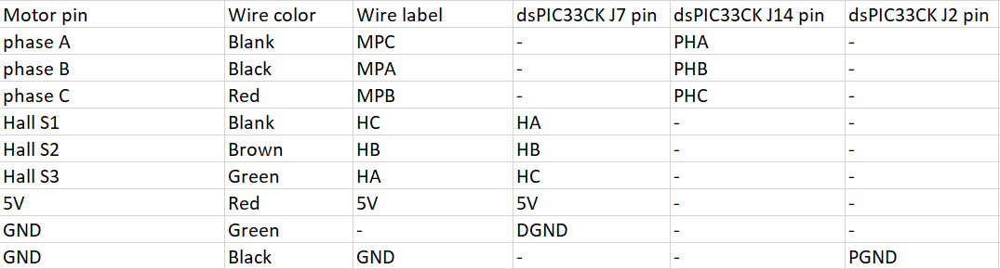
</p>

-  Then use 4x M3-nuts to fix it on the plexiglass, you could hide wires under the board.

<p align="center">
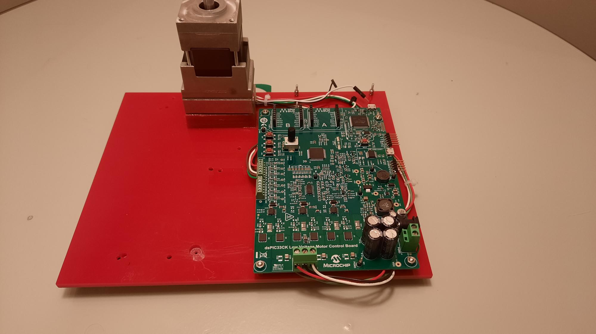
</p>

- Fix the WBZ451 Curiosity board to the bottom plexiglass piece with 3x M2-nuts.

<p align="center">
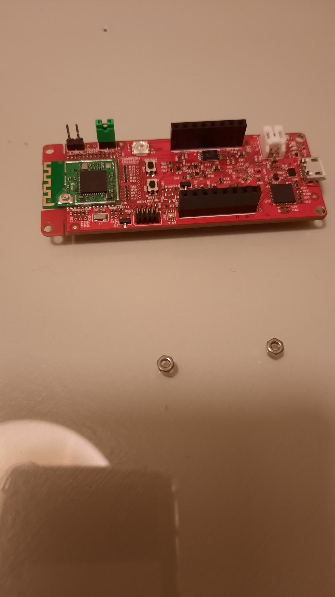
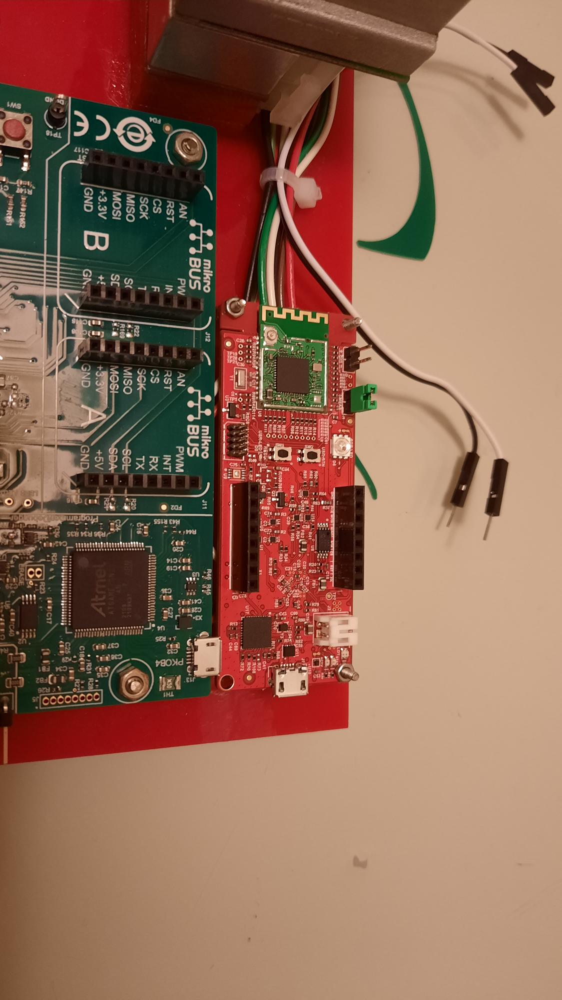
</p>

- Assemble the vertical plexiglass piece with 2 brackets, 4 M3-screws and 4 M3-nuts. Use M3-awl key (the larger one).

<p align="center">
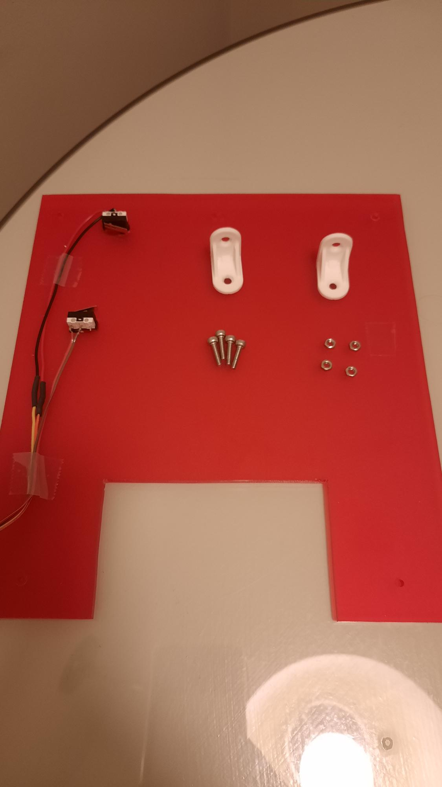
</p>

- Assemble the door and fix it to the top plexiglass piece :
  - Take the top plegiglass piece, the smooth rod, the threaded rod, 4 long M3-screws and 4 M3-nuts. 
  - Make sure to fix the rods correctly, the side with the large hole is for the smooth rod. 
  - When it is assemble and if you have the threaded rod in front of you, you should have a larger amount of plexiglass on your left.

<p align="center">
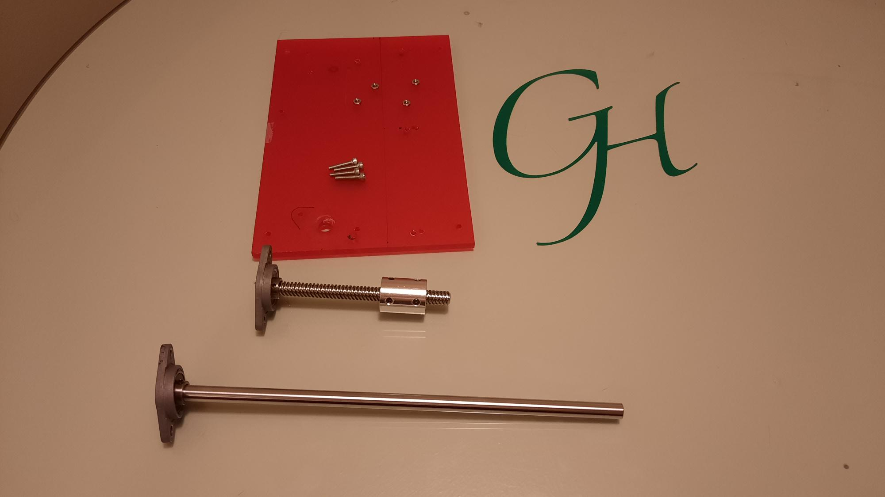

</p>

- Then take the door and screw it into the threaded rod, then put the coupling beam and fix it to the threaded rod with the M2-awl key (the smaller one).

<p align="center">
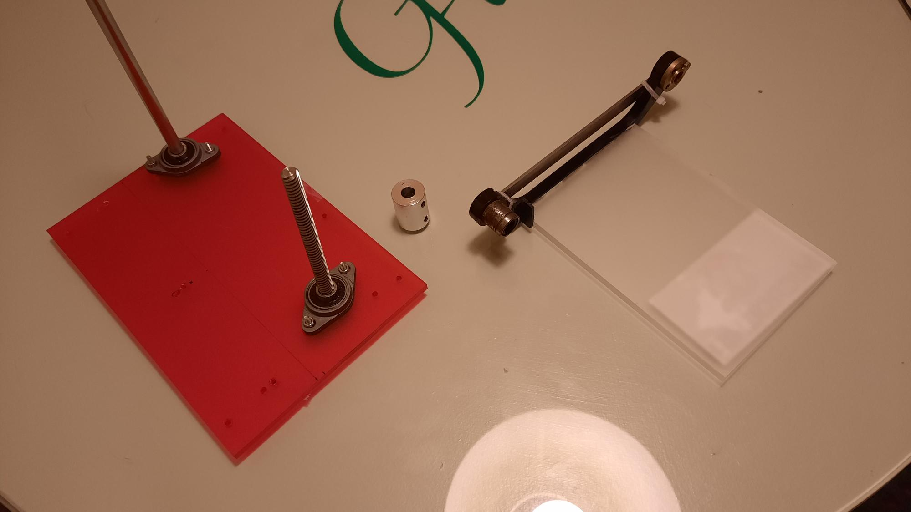
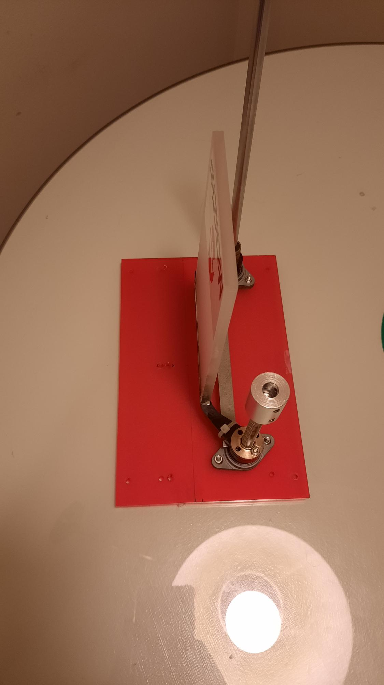
</p>

- Now fix the door to the structure using 3 brackets, 6x M3-screws and 6x M3-nuts.
  - Do not forget to plug the smooth rod into the small hole into the bottom plexiglass piece (there is two hole close to each other, choose the bottom left one).

<p align="center">
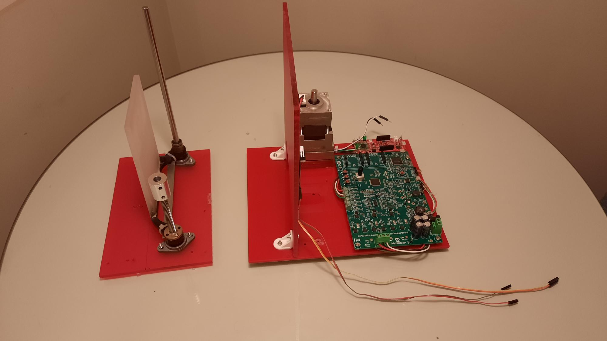
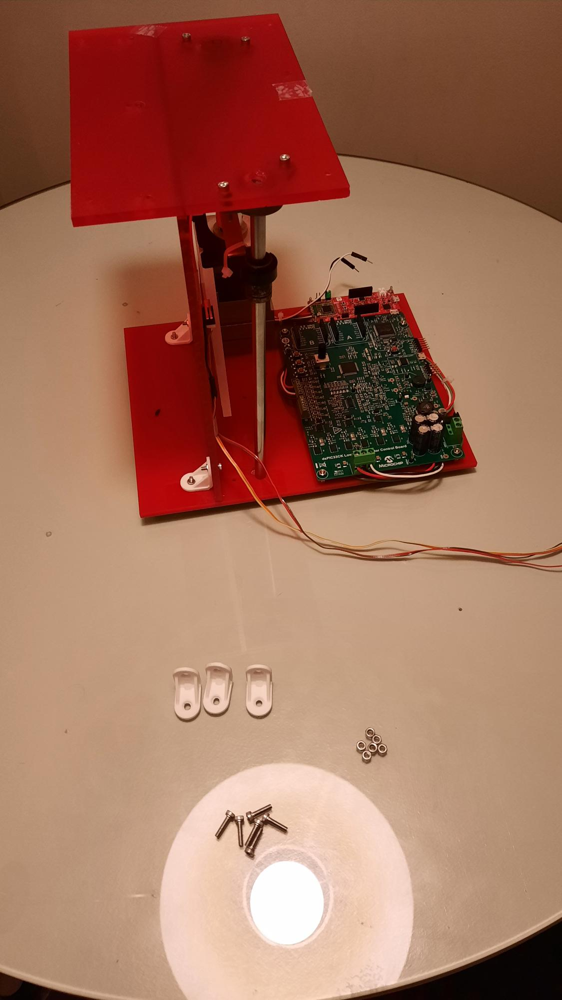
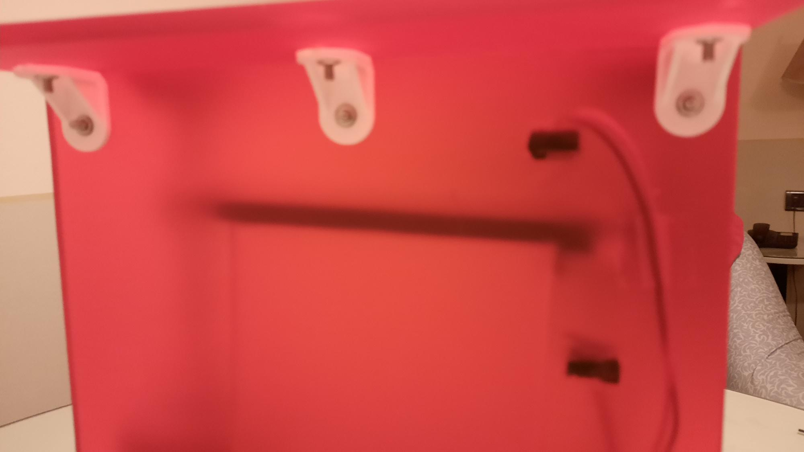
</p>

- Then fix the coupling beam to the motor with the M2-awl key.

- Finally, plug the cameras into the dual-MIPS connector on the MPF300 video kit, camera facing out of the board.

- Then fix it to the top plexiglass piece using 4x M3-screws. Make sure that the camera is facing out of the demo.

The demo is not ready yet, you have to connect the boards through wires according to this tab :

<p align="center">
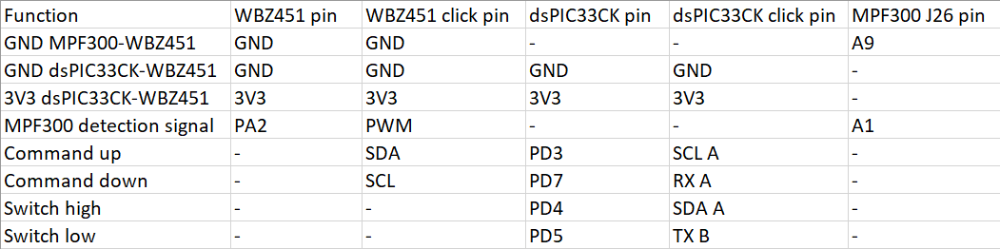
</p>

Now, let's connect the detection switches to the LVMC board.

<p align="center">

</p>

- Connect the switches to the dsPIC33CK LVMC board, the top one to click-A pin SDA and to GND, and the bottom one to click-B pin TX and GND.

<p align="center">
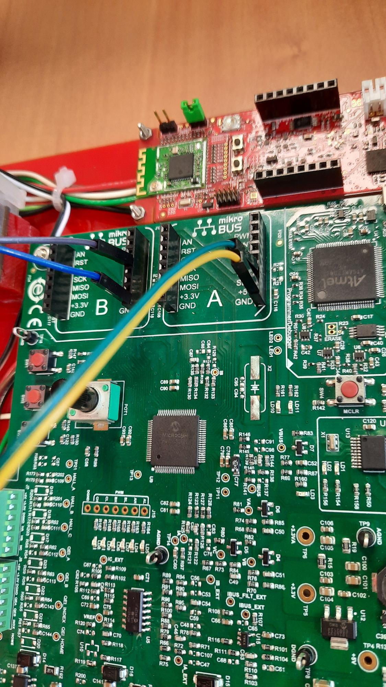
</p>

Now, let's add wires to connect the WBZ451 board to the LVMC board.

- Plug the commands wires between the WBZ451 Curiosity board and the dsPIC33CK LVMC board. WBZ451 click pin SDA to dsPIC33CK click-A pin SCL and WBZ451 click pin SCL to dsPIC33CK click-A pin RX.

<p align="center">
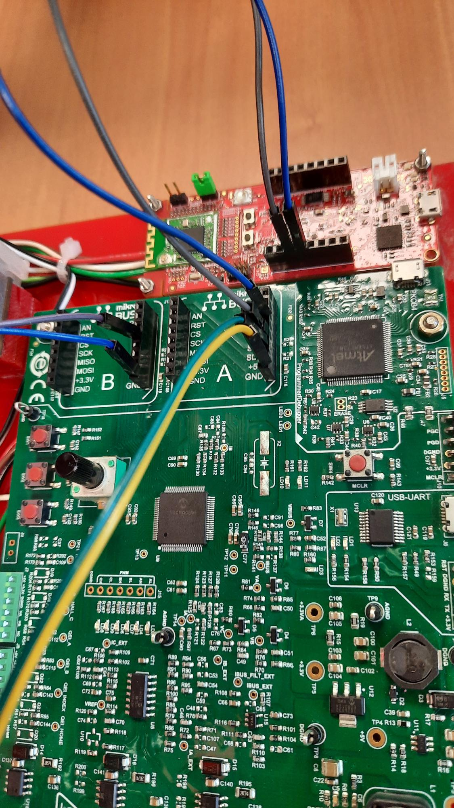
</p>

- Connect 3V3 and GND pins from dsPIC33CK to WBZ451 in order to power the WBZ451 Curiosity from the LVMC board.

<p align="center">
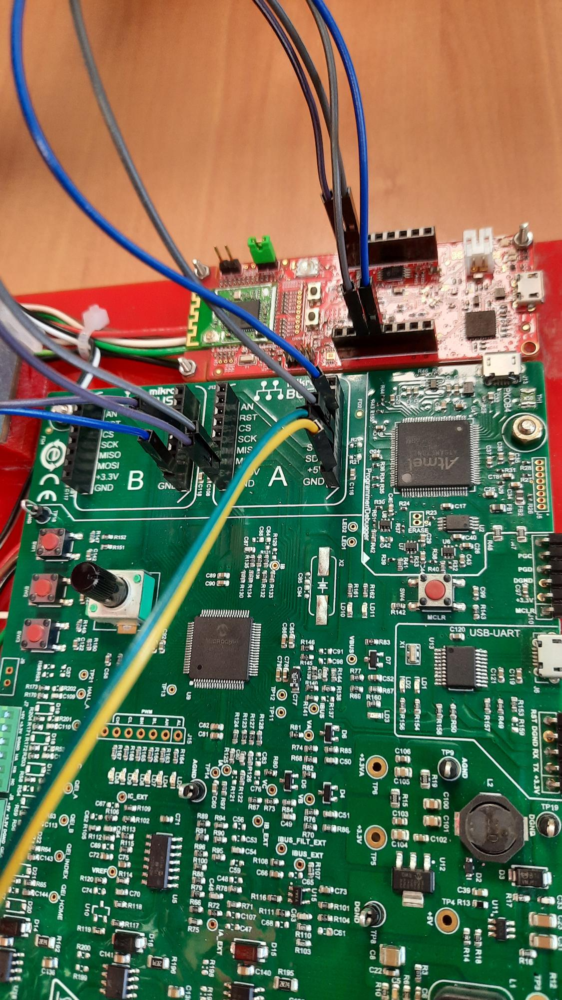
</p>

- Plug the black wire and the white wire (that are attached to motor wires) to GND and PWM pins of the WBZ451 mikroBus connector from one side. In the next step, both wires will be connected to MPF300.

<p align="center">
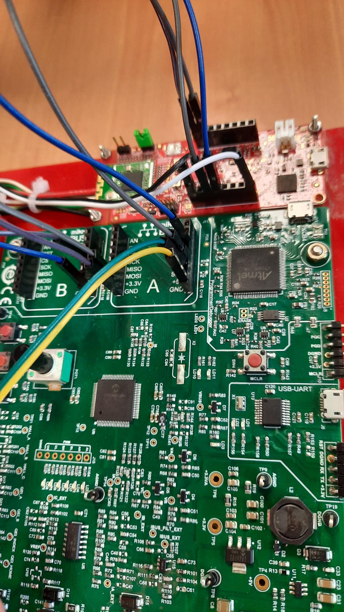
</p>

- And connect the same wires (black and white) to the MPF300 MIPS connector
  - GND (black wire) to A9 of the MPF300 MIPS connector
  - PWM (white wire) to A1 of the MPF300 MIPS connector

<p align="center">
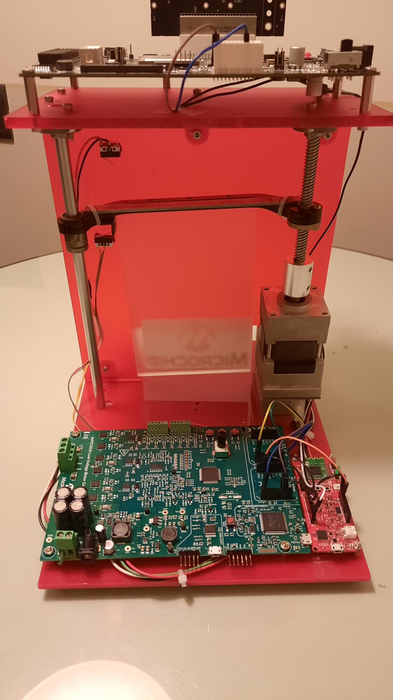
</p>

The door is now ready.

- Power up the MPF300 video kit with 12V power supply
- Power up the dsPIC33CK LVMC with 9V power supply
- Power the Amazon Echo
- Make sure your Amazon Echo is connected to your Wi-Fi Home network. 
  - Checkout [here](https://www.amazon.com/gp/help/customer/display.html?nodeId=GKC33PUJZTSDWQK6) for guidance.
- Go to <a href="#step5">Run the demo</a> section.


<a href="#top">Back to top</a>


## Do It Yourself <a name="step4"></a>

### Bill of materials <a name="step4a"></a>

#### Microchip Development Board

Purchase the following development boards:

- [dsPIC33CK LVMC Board](https://www.microchipdirect.com/dev-tools/DM330031)
- [WBZ45x IoT Board](https://www.microchipdirect.com/dev-tools/EA71C53A)
- [PolarFire FPGA Video Kit](https://www.microchipdirect.com/dev-tools/MPF300-VIDEO-KIT-NS)

#### Mechanical pieces

- [3-Phase Brushless DC Motor](https://www.microchip.com/en-us/development-tool/AC300020)
- [Coupling beam](https://www.amazon.fr/sourcing-map-Aluminium-Couplage-Connecteur/dp/B092D8WGNZ)
- [Threaded rod](https://fr.farnell.com/duratool/d00808/gougon-acier-inoxydable-m8/dp/2444322)
- [Smooth rod](https://fr.rs-online.com/web/p/tubes-et-profiles-de-structures/7866006)
- [2x limit switches](https://fr.farnell.com/omron-electronic-components/ss-5gl13/commutateur-encliquetable-spdt/dp/1608303)
- [Ball bearing](https://fr.rs-online.com/web/p/roulements-a-billes/6190036)
- [flange bearing](https://euro-makers.com/fr/roulements-a-billes/2592-httpeuro-makerscomroulements-a-billes2592-rou-plapkfl08html-3701172915174.html)

*Remark: One of the garage door piece (black plastic piece) is not refered and should be reproduced with a 3D printer to replicate the demo*

#### Structure

- [Plexiglass (PMMA)](https://www.leroymerlin.fr/produits/menuiserie/panneau-bois-tablette-etagere-tasseau-moulure-et-plinthe/verre-verre-synthetique-et-accessoires/verre-et-plaque-polystyrene/plaque-pmma-5-mm-rouge-mat-l-100-x-50-cm-80120003.html)
- 4x long M3-screws
- 18x M3-screws
- 4x M2-screws
- 22x M3-nuts
- 16x M2-nuts
- 5x brackets


#### Connectors and power supply

- HDMI cable
- Wires (20 should be enough)
- 9V power supply for dsPIC33CK LVMC Board
- 12V power supply for PolarFire FPGA Video Kit
- 18V power supply for the Amazon Echo

#### Others

- [Amazon Echo](https://www.amazon.fr/nouvel-echo-4e-generation-avec-son-premium-hub-connecte-et-alexa-anthracite/dp/B085FXHR38)
- [Philips Hue bulb](https://www.amazon.fr/Philips-connect%C3%A9e-Equivalent-Compatible-Bluetooth/dp/B099P3CP1K)
- A protected power strip with 4/5 plugs
- A Wi-Fi network provided by an Access-Point or a Router
- A Smartphone with Microchip Bluetooth Data App installed
- A display with HDMI input
- WD40 lubricant should be consider to smooth the mechanic of the demo

### Mechanical Setup <a name="step4b"></a>

#### Door structure

The structure of the door is composed of four plexiglass pieces. Brackets, screws and nuts are also required. You will also need a screw driver and a drill. 

- The bottom piece

<p align="center">

</p>

- The vertical piece

<p align="center">

</p>

- The top piece

<p align="center">

</p>

- The door itself

<p align="center">

</p>

#### Prepare the plexiglass for assembly

- On the bottom plexiaglass piece, you need to create spacer fixation for dsPIC33CK and WBZ451 boards. Moreover, you need to fix the vertical plexiglass piece through brackets. 
    - For WBZ451, drill 4 M2-holes and use M2-screws and M2-nuts to create spacers.
    - For dsPIC33CK, drill 4 M3-holes and use M3-screws and M3-nuts to create spacers.
    - To fix the bracket, drill 2 M3-holes and use M3-screws and M3-nuts to fix the brackets.
- The vertical plexiglass piece need to be fixed to the bottom plexiglass piece and to the top plexiglass piece through brackets.
    - On the top part, drill 3 M3-holes and use M3-screws and M3-nuts to fix the brackets.
    - On the bottom part, drill 2 M3-holes and use M3-screws and M3-nuts to fix the brackets.
- On the top piece, you need to fix the FPGA board through spacers, and you also need to fix it tho the vertical plexiglass piece.
    - To fix the FPGA, drill 4 M3-holes and use M3-screws (nuts is not required here, you can screw in the FPGA fixations).
    - Finaly, to fix the top piece to the vertical piece, drill 3 M3-holes and use M3-screws and M3-nuts to fix the brackets.

### Motor Setup <a name="step4c"></a>

Plug the coupling beam, the threaded rod then the black piece and the flange bearing. Then plug the coupling beam into the motorand fix the motor to the bottom plexiglass piece. You can adjust the motor to the size of the vertical piece with the space you leave betwee the motor and the threaded rod inside the coupling beam.

On the other side of the door plug the ball bearing into the black piece, then the smooth rod into the ball bearing and finaly into the flange bearing.

Once the door set up, you should fix the two flange bearing to the top plexiglass piece through long M3-screws and nuts.

### Hardware Setup <a name="step4d"></a>

<p align="center">

</p>

<p align="center">

</p>

<p align="center">

</p>

<p align="center">

</p>

<p align="center">

</p>


### Software Setup for the WBZ45x <a name="step4e"></a>

#### Software Content

Extract the file: *firmware/WBZ45x_project/WBZ45x_project.zip* to a hard drive root folder (i.e. *C:\ac_demo\firmware*).

#### Programming the precompiled hex file using MPLABX IPE

Plug the WBZ45x Curiosity board to your computer through a micro-USB cable.

Using MPLAB® IPE v6.0 :
- Select WBZ451 as Device to flash and hit the 'Apply' button
- Select the tool: Curiosity/Starter Kits (PKOB4)
- Browse the following .hex file: *firmware/WBZ45x_project/ble_zigbee_light_prov/precompiled_hex/ble_zigbee_light_prov.X.production.hex*
- Hit the 'Program' button

<p align="center">
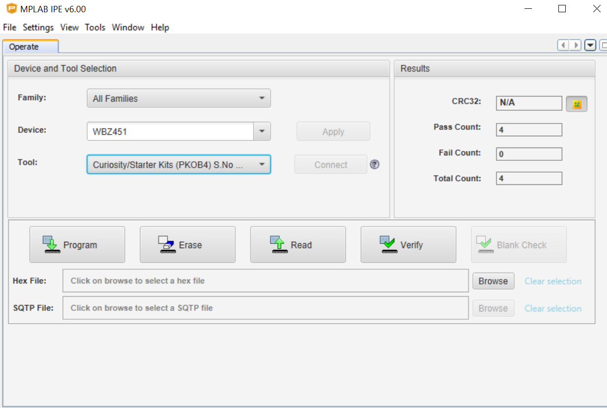
</p>

#### Starting from the Out of the box example

Here the code running on the WBZ45x Curiosity board, is based on the Out of the Box demo (OoB) example code named *ble_zigbee_light_prov* that you can find in:
- [WBZ45x Early adopter package](https://github.com/MicrochipTech/EA71C53A/tree/master/H3/wireless_apps_pic32cxbz2_wbz45/apps/multiprotocol/ble_zigbee_light_prov)
- [Harmony GitHub](https://github.com/Microchip-MPLAB-Harmony/wireless_apps_pic32cxbz2_wbz45/apps/multiprotocol/ble_zigbee_light_prov)

##### Required software components

Please follow the [SDK setup](https://github.com/MicrochipTech/EA71C53A/blob/master/Documentation/PIC32CX-BZWBZ45x%20SDK%20Setup.pdf) to get a workspace well configured and ready to modify the MCC Harmony project and the code, build and flash the WBZ451 target.

##### MCC Harmony Configuration

Open *ble_zigbee_light_prov/firmware/ble_zigbee_light_prov.X* from Harmony apps and start MCC Harmony. 

The main MCC Harmony scheme will not be modified, we will just add 3 I/Os to manage communication between the WBZ45x board and the two daughter boards: FPGA and motor control boards:

- Pin RA2 configured as EXTINT3 with a pullup: to interface with the FPGA board
- Pin RA13 and RA14 configured as GPIO out: to interface with the motor control board

<p align="center">

</p>

In project graph, click on EIC component and configure channel 3 as following:

<p align="center">

</p>

Then generate the code and close MCC.

##### Code modification

**For this section, you will find all code to copy paste in the following folder: *firmware/WBZ45x_project/additional_sources***

- In *app.c* around line 250, add the code from *app.txt*.</br>
  Do not forget to add the prototype in *app.h*.
- In *app_button_handler.c* around line 92, replace **APP_Button_Handler** with the given function in *app_button_handler.txt*, and add function **APP_FPGA_Callback** and **APP_FPGA_Handler**. This code correspond to the trigger of the door and the wireless communications via the button and the face recognition. 
- In *app_ble_sensor.c* around line 115, replace **APP_TRPS_Sensor_LED_Ctrl** function with the given function in *app_ble_sensor.txt*. This code correspond to the trigger of the motor with BLE connectivity.</br>
Do not forget to add the prototype in *app_button_handler.h*
- In *app_zigbee_handler.c* line 560, replace switch case **CMD_ZCL_ON** and **CMD_ZCL_OFF** with those in *app_zigbee_handler.txt*. This snippet of code correspond to the trigger of the motor with ZigBee connectivity.

### Software Setup for the dsPIC33CK <a name="step4f"></a>

#### State machine

<p align="center">

</p>

#### Software Content

Extract the file: *firmware/dsPIC33CK_project/dsPIC33CK_project.zip* to a hard drive root folder (i.e. *C:\ac_demo\firmware*).

#### Programming the precompiled hex file using MPLABX IPE

Plug your PICkit3 or PICkit4 to your computer through a micro-USB cable and to the dsPIC33CK LVMC board through the 6-pins connector on the right side of the board.

Using MPLAB® IPE v6.0 :
- Select dsPIC33CK256MP506 as Device to flash and hit 'Apply'
- Select the Tool: PICkit3 or PICkit4
- Browse the following .hex file: *firmware/dsPIC33CK_project/precompiled_hex/bldc.X.production.hex*
- Hit 'Program' button

<p align="center">

</p>

#### Start from AN957 Application note

##### Required software components

- [MPLAB® X v6.0](https://www.microchip.com/en-us/tools-resources/develop/mplab-x-ide)
- [Microchip Code Configurator (MCC) v5.1.17](https://www.microchip.com/en-us/tools-resources/configure/mplab-code-configurator)

##### MCC Configuration

Open *dsPIC33CK_project/bldc.X* and start MCC. We will just add 4 I/Os to manage the limit switchs interrupts and the communication between the WBZ45x curiosity and motor control board:

- RA5 - interrupt INPUT pin comming from the bottom switch
- RA6 - command OUTPUT pin to open the door
- RA7 - command OUTPUT pin to close the door
- RA15 - interrupt INPUT pin comming from the upper switch

First, open the grid view and activate the 4 pins:

<p align="center">
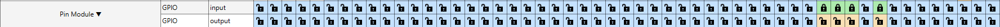
</p>

Then configure the pins as following:

<p align="center">

</p>

Generate the code and close MCC.

##### Code modification

Open *firmware/dsPIC33CK_project/additional_sources/main.txt* and copy paste the code into the *main.c* file of your project.

This code correspond to :

- The main state machine of the application.
- The motor control state machine.
- The handler for the switch interrupts.
- Some other functions used in the motor control state machine.


### Software Setup for the PolarFire FPGA <a name="step4g"></a>

#### Software content

The GitHub repo does not contain the FPGA project but it contains all the steps to customize the original VectorBlox and face recognition demo.

To match with the Access Control demo, it is required to:

* Get started with the default package by installing the required tools
* Customize the default demo package
* Set the image database for Face recognition
* Flash the board with updated content

#### Getting started with the default package

To getting started with default package VectorBlox and face recognition, make sure to check the following items:

- Download the VectorBlox SDK from [GitHub](https://github.com/Microchip-Vectorblox/VectorBlox-SDK.git) and use the Programmers Guide to install
- Purchase the [PolarFire FPGA Video and Imaging Kit](http://www.microsemi.com/existing-parts/parts/150804)
- Download and install [Libero® SoC Design Suite 2021.3](https://www.microchip.com/en-us/products/fpgas-and-plds/fpga-and-soc-design-tools/fpga/libero-software-later-versions)
- Get a free [Libero SoC Silver License](https://www.microchipdirect.com/fpga-software-products)
- Get a free [Libero SoC VectorBlox License](https://www.microchipdirect.com/fpga-software-products) (required in addition to the above license)
- **[Reference Design](https://vector-blox-model-zoo.s3.us-west-2.amazonaws.com/Releases/VideoKit/vectorblox_videokit_v1.3.1.zip) for the PolarFire FPGA Video and Imaging Kit** (need to be updated with the new project to match this demo)

#### Demo customization

1. Download the [Libero® SoC 2021.3 Smart Camera Reference Design](https://vector-blox-model-zoo.s3.us-west-2.amazonaws.com/Releases/VideoKit/vectorblox_videokit_v1.3.1.zip) for the PolarFire FPGA Video and Imaging Kit

2. We will have to set an open drain output that we will connect to the WBZ45x Curiosity board. If the PolarFire recognize a person, the WBZ45x device will ask the motor control board to open the garage door. The state of the I/O will change and go from 0 to 1 while there is a person recognized by the system.

   a. Unzip and open the vectorblox_videokit_v1.3.1 project from the original [Reference Design](https://vector-blox-model-zoo.s3.us-west-2.amazonaws.com/Releases/VideoKit/vectorblox_videokit_v1.3.1.zip)

   b. Open the project using [Libero® SoC Design Suite 2021.3](https://www.microchip.com/en-us/products/fpgas-and-plds/fpga-and-soc-design-tools/fpga/libero-software-later-versions)

   c. Modify CoreGPIO_OUT in PROC_SUBSYSTEM

   * Add 2 OUTPUT - in our case GPIO_OUT[6:5] and leave the settings by default</br></br>

   * Update PROC_SUBSYSTEM_0 and promote the new GPIO_OUTPUT to Top Level
   * As we want to have open drain outputs, please refer to cahpter 7.1.13 of the ["PolarFire FPGA and PolarFire SoC FPGA User I/O User Guide"](https://ww1.microchip.com/downloads/aemDocuments/documents/FPGA/ProductDocuments/UserGuides/Microchip_PolarFire_FPGA_and_PolarFire_SoC_FPGA_User_IO_User_Guide_VC.pdf)
   </br></br>

   * You will then have to update the I/O Attributes. On the PolarFire Video Kit, we will use pins from the Display Connector J26. </br>
   So, we will connect our outputs as below:</br>
     - Connect OUT 1 to pin A2 of the PolarFire FPGA (Pin B1 of the Video Kit Display Port)
     - Connect OUT 2 to pin B4 of the PolarFire FPGA (Pin A1 of the Video Kit Display Port)
     - I/O Configuration:
        - Clamp = OFF
        - RES_PULL = NONE
        - Bank VDDI = 2.5V
        
   </br></br>

   Your project is now ready, you should be able to RUN the project.

3. We will now modify the Software in SoftConsole

   a. In *main.c*, you will need to define OUT1 & OUT2

   ```
   #define OUT1 GPIO_5
   #define OUT2 GPIO_6
   ```

   b. Then, setup the GPIOs as output

   ```
   GPIO_set_output(&g_gpio_out, OUT1, 1) ;
   GPIO_set_output(&g_gpio_out, OUT2, 1) ;
   ```

   c. In the file *faceDetectDemo.c*, set the custom GPIOs to 0 if there is a similarity and face recognized
   </br></br>

   d. Then, in the file *faceDetectDemo.c*, set the output back to 1 when the program is starting to scale a new frame
   </br></br>

   Your software is now modified.


#### Setting-up the image database for Face Recognition

1. The project is already running the face recognition Demo using the existing Image Database as created by the VectorBlox-SDK at the following Link. </br> [https://github.com/Microchip-Vectorblox/VectorBlox-SDK/tree/master/example/python/faceDemo/dbImages](https://github.com/Microchip-Vectorblox/VectorBlox-SDK/tree/master/example/python/faceDemo/dbImages)

2. To detect known faces in the surroundings through Videokit, the Image Database in the project must be updated with the new Images. To update the Image Database, one need to be able to execute examples and tutorials for VectorBlox-SDK Release 1.3. </br> To setup the VectorBlox-SDK following steps must be followed.</br>  [https://github.com/Microchip-Vectorblox/VectorBlox-SDK](https://github.com/Microchip-Vectorblox/VectorBlox-SDK)

3. Download the [VectorBlox-SDK release 1.3.0](https://github.com/Microchip-Vectorblox/VectorBlox-SDK/releases/tag/release-v1.3.0)

4. Change the permissions of the copied folder using:</br> 
```sudo chmod -R 777 VectorBlox-SDK-release-v1.3.0/```

5. Follow the below steps</br>
```
cd VectorBlox-SDK-release-v1.3.0/
sudo bash
```
(Note: remember executing the scripts in the SDK requires switching to bash)
```
bash install_dependencies.sh
source setup_vars.sh
```

6. Before updating the database, follow the below steps</br>
[https://github.com/Microchip-Vectorblox/VectorBlox-SDK/blob/master/app_notes/updating_face_recognition_database.md#preparing-models](https://github.com/Microchip-Vectorblox/VectorBlox-SDK/blob/master/app_notes/updating_face_recognition_database.md#preparing-models)
```
cd $VBX_SDK/tutorials/mxnet/mobilefacenet-arcface
bash mobilefacenet-arcface.sh
```
(Before creating the Database step, the known Images should be copied to the following folder of WSL ubuntu)

*C:\Users\MXXXXX\AppData\Local\Packages\CanonicalGroupLimited.Ubuntu20.04LTS_79rhkp1fndgsc\LocalState\rootfs\home\username\VectorBlox-SDK-release-v1.3.0\example\python\faceDemo\dbImages*

(Note: only images in .png and .jpg format are accepted)


7. Issue the following commands to update the Database</br>
[https://github.com/Microchip-Vectorblox/VectorBlox-SDK/blob/master/app_notes/updating_face_recognition_database.md](https://github.com/Microchip-Vectorblox/VectorBlox-SDK/blob/master/app_notes/updating_face_recognition_database.md)

```
cd example/python/faceDemo/
python createdDb.py
python exportDb.py
```

(Note: python processImage.py command throws errors, but it is not required as it is only a sanity check on the added Images which is not working in this release. In addition, the steps to update the Database are described on the following link as well.)


8. Copy the code generated in *C:\Users\MXXXXX\AppData\Local\Packages\CanonicalGroupLimited.Ubuntu20.04LTS_79rhkp1fndgsc\LocalState\rootfs\home\username\VectorBlox-SDK-release-v1.3.0\example\python\faceDemo\faceDb.c* to the following .c file of the SoftConsole Project: *C:\Users\ MXXXXX\Downloads\vectorblox_videokit_v1.3\softconsole\Videokit\faceDetection\faceDetectDemo.c*. </br>
Copy the entire code from the generated file *faceDb.c* and replace the corresponding code in *faceDetectDemo.c* from the SoftConsole Project starting at the line number 79</br>
```
#define DB_LENGTH 79
#define EMBEDDING_LENGTH 128
```

9. Build the SoftConsole Project and one should be able to run the Demo with updated Database through FlashPro Interface. The Project can be built in Release Mode. Debug Mode build shows error which must be fixed. Release Mode is good enough to run the Demo

10. To run the Demo without Debug Interface, updated SoftConsole Project hex file should replace the existing FabricRAM hex file in the Libero SoC Project. For further details about how to program the FPGA and SPI Flash with the updated files, refer to the Section 5.2.2 in the below document.</br>
[https://vector-blox-model-zoo.s3.us-west-2.amazonaws.com/Releases/VideoKit/vectorblox_videokit_v1.3.pdf](https://vector-blox-model-zoo.s3.us-west-2.amazonaws.com/Releases/VideoKit/vectorblox_videokit_v1.3.pdf)

#### Flash the board

Follow the documentation below to flash the board with the new images:

- Read the [Programmers Guide](https://github.com/Microchip-Vectorblox/VectorBlox-SDK/blob/master/docs/VectorBloxPG.pdf) and the [Demo Guide](https://vector-blox-model-zoo.s3.us-west-2.amazonaws.com/Releases/VideoKit/vectorblox_videokit_v1.3.pdf) to install the reference design


### Cloud Setup <a name="step4h"></a>

#### Amazon Echo setup

- Power on the amazon echo and download the Alexa app on your smartphone.
- Then, open Alexa app and under *add device* section, select *echo*. 
- On your Echo, enter configuration mode by pressing the action switch during 10 seconds.
- Then on the app, enter your access point SSID and password to configure your Echo.

#### WBZ451 provisionning

Once the Echo is configured, you can provision your WBZ451 device by asking *Alexa, discover my devices* or in the app by adding a device, selecting *light*.

In the same time, on Microchip Bluetooth Data app, enter *BLE commissioning* section, launch a scan to find your WBZ451.

Once the device selected, you can change the name and provision it.

Start the provisionning and wait for 30 to 45 seconds.

If the Echo found your WBZ451, it will automatically register it in the Alexa app as a light. Then you can go into *Device* select the new device and rename it *Garage door*.

#### Add a Philips Hue light

- Plug the Philips Hue bulbe into the light. 
- Then discover the devices, the Philips light should slowly blink. 
- Once the provisionning finished, the light should stay on. 
- Then go into the Alexa app, into *Devices* section select *Light* and rename the new one *Philips light*. 

#### Alexa routine

On the Alexa app go into *Other* tab and select *Routines*. Create 4 new routines :

- The first one is to open the door:
    - Rename the routine *Open garage door*
    - As input select *voice* and write down *Open garage door*.
    - As action select *Home*, then *Light*, then *Garage door* and hit *next*. On the new section select *On* and validate.
    - Add another action, select *Home*, then *Light*, then *Philips light* and hit *next*. On the new section select *Off* and validate.

- The second one is to close the door:
    - Rename the routine *Close garage door*
    - As input select *voice* and write down *Close garage door*.
    - Add another input, select *voice* and write down *Turn on Garage light*.
    - As action select *Home*, then *Light*, then *Garage door* and hit *next*. On the new section select *Off* and validate.
    - Add another action, select *Home*, then *Light*, then *Philips light* and hit *next*. On the new section select *On* and validate.

- The third one is to turn on the light:
    - Rename the routine *turn on garage light*
    - As input select *voice* and write down *turn on garage light*.
    - As action select *Home*, then *Light*, then *Garage door* and hit *next*. On the new section select *Off* and validate.
    - Add another action, select *Home*, then *Light*, then *Philips light* and hit *next*. On the new section select *On* and validate.

- The forth one is to turn off the light:
    - Rename the routine *turn off garage light*
    - As input select *voice* and write down *turn off garage light*.
    - Add another input, select *voice* and write down *Turn on Garage light*.
    - As action, select *Home*, then *Light*, then *Philips light* and hit *next*. On the new section select *Off* and validate.


<a href="#top">Back to top</a>


## Run the demo <a name="step5"></a>

To lauch the demo, follow these steps :

- Turn ON the FPGA board with the ON/OFF switch close to the power supply connector.
- Go on Alexa app, make sure that the garage door is OFF (closed position).
- Then, reset the WBZ451, application LED should be OFF. 
- And reset the dsPIC33CK LVMC, if the door was not close, it should automatically close it.

To trigger the door with face recognition feature, just pass in front of the camera.

The vocal commands to trigger the door through Alexa are:

- Alexa, open garage door
- Alexa, close garage door
- Alexa, turn on garage light
- Alexa, turn off garage light

To trigger the door via your smartphone:

- Launch Microchip Bluetooth Data App
- Go in the BLE sensor section, select PIC32CX-BZ2 then scan to find the WBZ451 device
- Select the device that appear on the screen and now you can trigger it through BLE using the switch on the app.

Use the visual indicators to monitor the behavior of the demo:

- On WBZ451 Curiosity Board:
   - Blue LED: indicate connection status ("Off" when connected).
   - RGB LED: application LED.
- On dsPIC33CK LVMC:
   - 6 green LEDs in a row: indicate the motor status ("On" when motor is running).
   - LED 10: indicate that the dsPIC has receive a UP command. Turn off when the door reach the top position.
   - LED 11: indicate that the dsPIC has receive a DOWN command.Turn off when the door reach the bottom position.
- On MPF300:
   - On the screen, there is green squares when a person is recognized and blue squares when a the person is not recognized.

HMI:

- On WBZ451:
   - Reset switch: left one when looking at the back of the door.
   - Application switch: right one when looking at the back of the door.
- On dsPIC33CK LVMC:
   - Reset switch : in the center of the board.
- On MPF300:
   - On/Off switch: close to power supply connector.


<a href="#top">Back to top</a>

## FAQ <a name="step6"></a>

Here is the list of known issues:

- The motor can have difficulties to go up. If the motor stop between the up and down position, either LED10 or LED11 will remain on. In this case the motor can receive any other command, you should perform a reset.
- WD40 lubricant should be consider to smooth the mechanic of the demo.
- WBZ451 may lost ZigBee or BLE connection. In this case, you should perform a reset.
- Sometime, after several usage of the door, the motor may fail (wrong direction or no start at all). It is recommended to perform a reset every 10 demo cycles.
- After several Hours running, the FPGA may overheat, in this case the screen will freeze. The FPGA will need to be rebooted with the on/off switch next to the power supply connector. 

Reset procedure:

- On Alexa app, make sure that the garage door is Off (Closed position).
- Reset the WBZ451, application LED should be Off.
- Reset the dsPIC33CK LVMC, if the door was not close, it should automatically close it.

Possible improvement items:

- Implement bidirectional communication (e.g. UART) between WBZ451 Curiosity board and the dsPIC33CK to improve reliability of the demo
- Review the motor state machine and make it more robust to not miss direction changes after several cycles
- Make the mechanical parts of the demo more robust to reduce vibration and improve the door alignment during the go up and go down phases


<a href="#top">Back to top</a>
